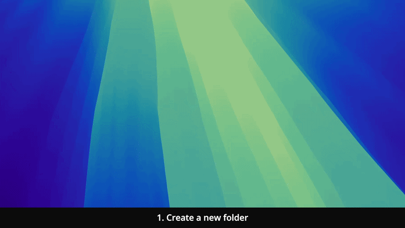
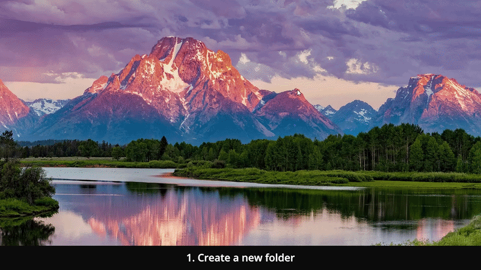

# Moss AI Token Cost Tracker

A dashboard for tracking your team's AI token spend (Anthropic + OpenAI) - no data leaves your machine.

<details open>
<summary>macOS setup guide (GIF)</summary>



</details>

<details>
<summary>Windows setup guide (GIF)</summary>



</details>

## Prefer letting an AI assistant set this up for you?

If you have [Claude Code](https://claude.com/claude-code) or the [Codex CLI](https://github.com/openai/codex) installed, you can hand them the whole job. Unlike a web chat, they run in your terminal with access to your files and to run commands, so they can install, start the tool, and fix errors as they come up.

The same prompt works both for the initial setup and every time after, when you just want to run the tool again.

1. Open Terminal or PowerShell wherever you'd like the project folder to be created (e.g. your Desktop).

2. Run `claude` or `codex`, then paste this prompt as your first message:

   ```
   Clone and set up the "Moss AI Token Cost Tracker" tool for me — a local
   dashboard for tracking Anthropic/OpenAI token spend. Act as my setup
   assistant using your file system and terminal access:

   1. First check whether the current folder (or a `moss-ai-token-cost-tracker`
      subfolder) already contains this tool (look for server.mjs and
      index.html). If it's already there, run `git pull` inside that folder
      to get the latest changes, then skip straight to step 3.
   2. Otherwise, clone the repo:
      git clone https://github.com/getmoss/moss-ai-token-cost-tracker.git
      then work from inside that folder, and check whether Git, nvm, and
      Node.js 24.14.1 (per this repo's README) are installed, installing or
      switching to whatever is missing.
   3. Ask me whether I want to run it in production mode (connecting my real
      Anthropic/OpenAI accounts with API keys) or demo mode (mocked data, so
      I can just see how the dashboard looks without any API keys). Wait for
      my answer before continuing.
   4. Double check that everything needed is set up correctly, and then run
      `npm start` for production mode, or `npm run demo` for demo mode, based
      on my answer.
   5. Watch the terminal output for errors. If something fails, diagnose the
      root cause, explain it to me in plain language, and either fix it or
      tell me exactly what to run.
   6. Tell me the URL to open in my browser once the server is running.
   7. Later, if I ask you to stop or restart the tool, do that for me.

   Important: never read, print, or send the contents of my .env file, and
   never share any API keys or company data outside this terminal session.
   ```

## Set up and run the tool

This requires a one-time technical setup below. Complete it once, then just repeat the "Start the tool" steps whenever you want to use the dashboard again.

Terminal (Mac) and PowerShell (Windows) are text windows for giving instructions directly to your computer. Every command below is shown in a code box - copy it, paste it into Terminal or PowerShell, and press Return or Enter. If a box contains several commands, run them one at a time; you don't need to write or change any of them.

The installation commands below download the public code and the programs needed to run it, including Node.js. They do not access your AI accounts or spend data. If your company restricts software installation, ask your IT team to complete the setup.

### Open Terminal or PowerShell

<details>
<summary>macOS</summary>

1. Press `⌘ Command + Space`.
2. Type `Terminal`.
3. Press Return.

</details>

<details>
<summary>Windows</summary>

1. Open the Start menu.
2. Type `PowerShell`.
3. Press Enter.

</details>

Keep this window open while following the instructions below - the dashboard will not open during installation.

## Initial installation (one-time)

<details>
<summary>macOS installation guide</summary>

1. Install Git (lets your computer copy the tool from GitHub):

   ```bash
   xcode-select --install
   ```

   A separate installation window may appear - follow its instructions, then close and reopen Terminal. If Git is already installed, your Mac will tell you and you can continue.

2. Clone this repo:

   ```bash
   git clone https://github.com/getmoss/moss-ai-token-cost-tracker.git
   cd moss-ai-token-cost-tracker
   ```

3. Install nvm (the Node version manager, so the tool uses the right Node.js version):

   ```bash
   curl -o- https://raw.githubusercontent.com/nvm-sh/nvm/v0.40.1/install.sh | bash
   ```

   Then restart your terminal (or run source ~/.zshrc).

4. Install the specific Node version:

   ```bash
   nvm install 24.14.1
   ```

5. Use it:

   ```bash
   nvm use 24.14.1
   ```

6. Set a default version so nvm loads it automatically every time:

   ```bash
   nvm alias default 24.14.1
   ```

</details>

<details>
<summary>Windows installation guide</summary>

1. Install Git (lets your computer copy the tool from GitHub):

   ```bash
   winget install --id Git.Git -e
   ```

   Approve the installation if asked, then close and reopen PowerShell.

2. Clone this repo:

   ```bash
   git clone https://github.com/getmoss/moss-ai-token-cost-tracker.git
   cd moss-ai-token-cost-tracker
   ```

3. Install nvm-windows (so the tool uses the right Node.js version):

   ```bash
   winget install CoreyButler.NVMforWindows
   ```

   Approve the installation if asked, then close and reopen PowerShell.

4. Install the specific Node version:

   ```bash
   nvm install 24.14.1
   ```

5. Use it:

   ```bash
   nvm use 24.14.1
   ```

6. If PowerShell blocks npm with a "running scripts is disabled" error, allow locally-created scripts to run:

   ```bash
   Set-ExecutionPolicy -Scope CurrentUser -ExecutionPolicy RemoteSigned
   ```

   Confirm the change if asked. This only changes the setting for your Windows user and allows locally created scripts to run.

</details>

<details>
<summary>Troubleshooting tip</summary>

If something does not work, take a screenshot of the Terminal or PowerShell error and upload it to ChatGPT, Claude or another AI assistant asking what is blocking the setup and which command you should run next (make sure it contains no API keys or sensitive company data).

</details>

## Start the tool

Once the initial installation is complete, you don't need to install anything else. Follow these steps whenever you want to open the dashboard, including the next time you restart your computer or close the tool.

1. Open Terminal or PowerShell already inside the project folder — no need to type `cd`:

   - **macOS**: In Finder, right-click the `moss-ai-token-cost-tracker` folder (the project root) and choose **New Terminal at Folder**.
   - **Windows**: In File Explorer, right-click the `moss-ai-token-cost-tracker` folder (the project root) and choose **Open in Terminal**.

2. Start the tool:

   ```bash
   npm start
   ```

   Keep Terminal or PowerShell open while using the dashboard - closing the window stops the tool.

3. Open the dashboard. The browser does not open automatically, so open the following address yourself:

   [http://localhost:4173](http://localhost:4173)

   The dashboard runs locally on your computer rather than on a public website, and the address only works while the tool is running in Terminal or PowerShell.

Follow the on-screen setup to connect your provider Admin API keys. Enter these keys only inside the local application - never in Terminal, email, Slack or a support message.

To stop the tool, return to Terminal or PowerShell and press `Ctrl + C`. To use it again later, repeat the steps above.

## Demo mode (no API keys needed)

Want to try it out without connecting real accounts? Run:

```bash
npm run demo
```

Then open [http://localhost:4173](http://localhost:4173), and enter anything (e.g. `demo`) as the API key(s) on the setup screen. Every request is served from realistic mock data instead of calling Anthropic/OpenAI, so nothing real is read or charged. A "Demo - sample data" banner stays visible the whole time so it's never mistaken for a live dashboard.

## Useful commands

| Command                    | What it does                                                                                 |
| --------------------------- | --------------------------------------------------------------------------------------------- |
| `npm start`                 | Runs the local server on port `4173`                                                          |
| `npm run demo`              | Runs the dashboard in demo mode with mock data, no API keys required                          |
| `npm test`                  | Runs the test suite                                                                           |
| `npm run reset-onboarding`  | Clears your `.env` (backed up to `.env.bak`) and restarts you into the first-run setup flow    |

`.env.bak` may contain your previous API keys, so treat it as confidential.

## How it works and how your data stays local

Everything lives in two files: `server.mjs` (a dependency-free Node HTTP server) and `index.html` (a single self-contained page - styles, fonts, and scripts all inlined, no build step). This is why the dashboard appears in a browser even though nothing is hosted online.

Your Admin API keys are stored in your local `.env` file and used to request usage and cost data directly from the Anthropic and OpenAI Admin APIs. The returned data is processed on your computer - your keys and spend data are never sent to or stored by Moss.

## Requirements

- [Node.js](https://nodejs.org/) 22 or newer

## License

[MIT](./LICENSE) © Moss
