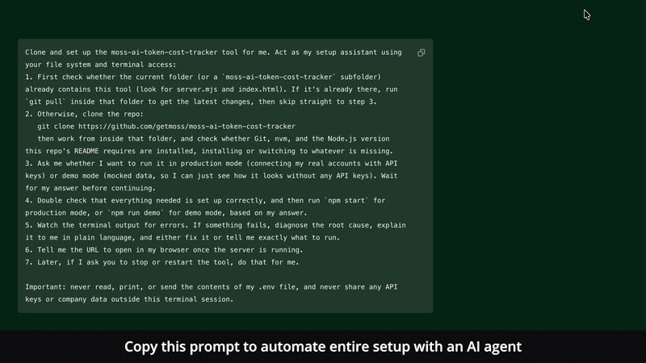
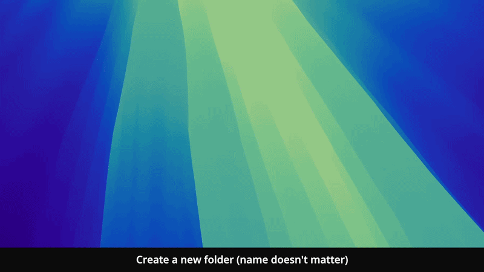

# Moss AI Token Cost Tracker

A dashboard for tracking your team's AI token spend (Claude + ChatGPT) - no data leaves your machine.

## Set up and run the tool

Complete the one-time installation below, then just repeat the "How to run the app" steps whenever you want to use the dashboard again.

<details>
<summary>AI prompt setup guide (GIF)</summary>



#### Installation

If you have [Claude Code](https://claude.com/claude-code) or [ChatGPT Codex](https://github.com/openai/codex), you can hand them the whole job.

1. Open Claude Code or Codex.
2. Paste this prompt as your first message:

   ```
   Clone and set up the moss-ai-token-cost-tracker tool for me. Act as my
   setup assistant using your file system and terminal access:

   1. First check whether the current folder (or a `moss-ai-token-cost-tracker`
      subfolder) already contains this tool (look for server.mjs and
      index.html). If it's already there, run `git pull` inside that folder
      to get the latest changes, then skip straight to step 3.
   2. Otherwise, clone the repo:
      git clone https://github.com/getmoss/moss-ai-token-cost-tracker
      then work from inside that folder, and check whether Git, nvm, and the
      Node.js version this repo's README requires are installed, installing
      or switching to whatever is missing.
   3. Double check that everything needed is set up correctly, and then run
      `npm start`. The tool opens into a setup screen where I can connect my
      real accounts with API keys, or click "Preview with sample data" to
      see how it looks with mocked data first, without any API keys.
   4. Watch the terminal output for errors. If something fails, diagnose the
      root cause, explain it to me in plain language, and either fix it or
      tell me exactly what to run.
   5. Tell me the URL to open in my browser once the server is running.
   6. Later, if I ask you to stop or restart the tool, do that for me.

   Important: never read, print, or send the contents of my .env file, and
   never share any API keys or company data outside this terminal session.
   ```

#### How to run the app

The same prompt works both for the initial setup and every time after, when you just want to run the tool again - just open Claude Code or Codex inside the project folder and paste the same prompt.

</details>

<details>
<summary>Windows setup guide (GIF)</summary>


#### Installation (one-time)

Terminal is a text window for giving instructions directly to your computer. Every command below is shown in a code box - copy it, paste it into Terminal, and press Enter. If a box contains several commands, run them one at a time.

The installation commands below download the public code and the programs needed to run it. They do not access your AI accounts or spend data. If your company restricts software installation, ask your IT team to complete the setup.

1. Open Terminal: right-click the folder where you'd like the project to be created (e.g. your Desktop) and choose **Open in Terminal**. The tool will be installed inside whichever folder you click.

2. Install Git (lets your computer copy the tool from GitHub):

   ```bash
   winget install --id Git.Git -e
   ```

   Approve the installation if asked, then close and reopen Terminal.

3. Clone this repo:

   ```bash
   git clone https://github.com/getmoss/moss-ai-token-cost-tracker.git
   cd moss-ai-token-cost-tracker
   ```

4. Install Node.js (version 24.21.0 or newer): download the installer from [nodejs.org/en/download](https://nodejs.org/en/download) and run it.

**Troubleshooting tip**: if something does not work, take a screenshot of the Terminal error or copy the text and upload it to AI assistant asking what is blocking the setup and which command you should run next (make sure it contains no API keys or sensitive company data).

#### How to run the app

Follow these steps whenever you want to open the dashboard, including the next time you restart your computer or close the tool.

1. Open Terminal inside the project folder: right-click the `moss-ai-token-cost-tracker` folder and choose **Open in Terminal**.

2. Start the tool:

   ```bash
   npm start
   ```

   Keep Terminal open while using the dashboard - closing the window stops the tool.

3. Open the dashboard. Copy the `localhost` address from the Terminal output and open it in your browser.

   The dashboard runs locally on your computer rather than on a public website, and the address only works while the tool is running in Terminal.

Follow the on-screen setup to connect your provider Admin API keys. Enter these keys only inside the local application - never in Terminal, email, Slack or a support message.

To stop the tool, return to Terminal and press `Ctrl + C`. To use it again later, repeat the steps above.

**Demo mode (no API keys needed)**: want to try it out without connecting real accounts? On the setup screen, click "Preview with sample data" to see the dashboard filled with mocked data. You can exit the preview and connect your real keys at any time from the demo badge in the header.

**Useful commands**:

| Command                    | What it does                                                                                 |
| --------------------------- | --------------------------------------------------------------------------------------------- |
| `npm start`                 | Runs the local server on port `4173`                                                          |
| `npm run reset-onboarding`  | Restarts you into the first-run setup flow    |

`.env.bak` may contain your previous API keys, so treat it as confidential.

</details>

<details>
<summary>macOS setup guide (GIF)</summary>



#### Installation (one-time)

Terminal is a text window for giving instructions directly to your computer. Every command below is shown in a code box - copy it, paste it into Terminal, and press Enter. If a box contains several commands, run them one at a time.

The installation commands below download the public code and the programs needed to run it. They do not access your AI accounts or spend data. If your company restricts software installation, ask your IT team to complete the setup.

1. Open Terminal: right-click the folder where you'd like the project to be created (e.g. your Desktop) and choose **New Terminal at Folder**. The tool will be installed inside whichever folder you click.

2. Install Git (lets your computer copy the tool from GitHub):

   ```bash
   xcode-select --install
   ```

   A separate installation window may appear - follow its instructions, then close and reopen Terminal. If Git is already installed, your Mac will tell you and you can continue.

3. Clone this repo:

   ```bash
   git clone https://github.com/getmoss/moss-ai-token-cost-tracker.git
   cd moss-ai-token-cost-tracker
   ```

4. Install Node.js (version 24.21.0 or newer): download the installer from [nodejs.org/en/download](https://nodejs.org/en/download) and run it.

**Troubleshooting tip**: if something does not work, take a screenshot of the Terminal error and upload it to ChatGPT, Claude or another AI assistant asking what is blocking the setup and which command you should run next (make sure it contains no API keys or sensitive company data).

#### How to run the app

Follow these steps whenever you want to open the dashboard, including the next time you restart your computer or close the tool.

1.  Open Terminal inside the project folder: right-click the `moss-ai-token-cost-tracker` folder and choose **New Terminal at Folder**.

2. Start the tool:

   ```bash
   npm start
   ```

   Keep Terminal open while using the dashboard - closing the window stops the tool.

3. Open the dashboard. Copy the `localhost` address from the Terminal output and open it in your browser.

   The dashboard runs locally on your computer rather than on a public website, and the address only works while the tool is running in Terminal.

Follow the on-screen setup to connect your provider Admin API keys. Enter these keys only inside the local application - never in Terminal, email, Slack or a support message.

To stop the tool, return to Terminal and press `Ctrl + C`. To use it again later, repeat the steps above.

**Demo mode (no API keys needed)**: want to try it out without connecting real accounts? On the setup screen, click "Preview with sample data" to see the dashboard filled with mocked data. You can exit the preview and connect your real keys at any time from the demo badge in the header.

**Useful commands**:

| Command                    | What it does                                                                                 |
| --------------------------- | --------------------------------------------------------------------------------------------- |
| `npm start`                 | Runs the local server on port `4173`                                                          |
| `npm run reset-onboarding`  | Restarts you into the first-run setup flow    |

`.env.bak` may contain your previous API keys, so treat it as confidential.

</details>

## How it works and how your data stays local

This tool runs entirely on your own computer - no cloud server, no sign-up, no Moss-hosted service. Your API keys live only in a local `.env` file, and your computer uses them to fetch usage and spend data directly from Anthropic/OpenAI and show it on screen.

Nothing - not your keys, not your usage data, not your spend data - is ever sent to Moss or any other third party.

## Requirements

- [Node.js](https://nodejs.org/en/download) 24.21.0 or newer

## License

[MIT](./LICENSE) © Moss
